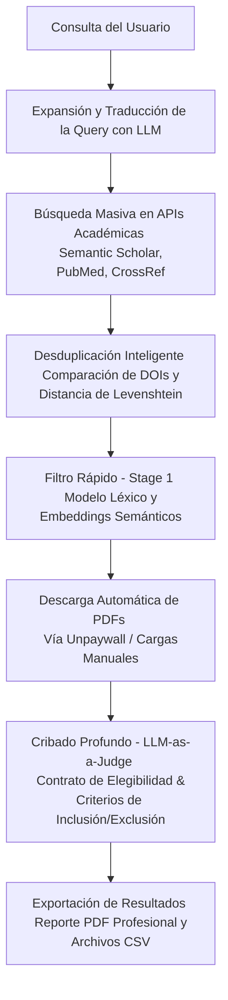

# PRISMA Assistant 📚🤖

**PRISMA Assistant** es un asistente inteligente diseñado para optimizar y automatizar revisiones sistemáticas de literatura (SLR) siguiendo rigurosamente el protocolo **PRISMA**. Utiliza técnicas avanzadas de **RAG (Retrieval-Augmented Generation)** y un sistema de evaluación de múltiples etapas basado en **LLM-as-a-Judge** para acelerar el filtrado de artículos académicos de manera precisa y trazable.

---

## 🚀 Flujo de Trabajo del Sistema

El asistente gestiona de extremo a extremo las fases iniciales de una revisión sistemática:



---

## ✨ Características Clave

* **🔍 Búsqueda Académica Masiva y Expansión de Consultas:** Generación de strings de búsqueda óptimos y sinónimos mediante LLM. Realiza búsquedas masivas de hasta 20,000 artículos consumiendo APIs de **Semantic Scholar**, **PubMed** y **CrossRef** de forma simultánea.
* **🧹 Desduplicación Inteligente:** Proceso automático que identifica y elimina registros duplicados usando identificadores unívocos (DOIs) y concordancia difusa (Fuzzy Matching usando Levenshtein) para títulos de artículos.
* **🚦 Cribado en Cascada (Multi-Stage Screening):**
  * **Stage 1 (Filtro Rápido):** Evaluación inicial de relevancia léxica y semántica rápida.
  * **Stage 4 (Cribado Profundo / LLM-as-a-Judge):** Análisis minucioso de resúmenes y secciones de PDFs usando un *Contrato de Elegibilidad*. Clasifica los artículos en *Incluidos*, *Excluidos* (con su respectiva justificación) o *Contexto/Background*.
* **📄 Extracción y Descarga de Textos Completos:** Integración con **Unpaywall** para la descarga legal y automatizada de PDFs open-access. Además, cuenta con un parser optimizado que extrae secciones clave del documento para evitar problemas de límite de tokens en los LLM.
* **💾 Persistencia Local y Sesiones:** Almacenamiento local en disco para resguardar las sesiones de usuario y evitar la pérdida de progreso (compatible también con MongoDB Atlas). Utiliza **ChromaDB** como base de datos vectorial persistente para búsquedas semánticas rápidas.
* **📊 Módulo de Evaluación Interna (Benchmark):** Herramienta protegida para evaluar métricas de clasificación (Precisión, Recall, F1-Score, Matriz de Confusión) contra un conjunto patrón (Gold Standard) para validar experimentalmente el rendimiento de los prompts y modelos.

---

## 👥 Arquitectura de Sesiones y Multi-usuario (Sin Login)

El sistema soporta el uso concurrente por múltiples personas sin necesidad de un registro o inicio de sesión tradicional. La independencia de cada usuario se garantiza de la siguiente forma:

1. **Generación Automática de Sesiones:** Cuando un usuario ingresa una nueva consulta de revisión, el backend genera un identificador de sesión único (`session_id`) usando una función hash basada en el contenido de la pregunta y la marca de tiempo exacta (`timestamp`).
2. **Aislamiento en Backend:**
   * La lista de artículos, criterios de búsqueda y progreso de cribado se guardan en un archivo JSON independiente (`session_{session_id}.json`) en el disco del servidor, o bien en un documento específico en MongoDB.
   * Los logs de auditoría de cada proceso se graban en una subcarpeta dedicada (`logs/session_{session_id}/`).
   * El flujo de progreso en tiempo real (SSE) se suscribe a un `client_id` único para cada ventana de navegador.
3. **Control del Lado del Cliente:** El navegador conserva este `session_id` (a través de la URL o variables de estado) para consultar exclusivamente las APIs de progreso y resultados de su propia revisión (ej. `/cascade_status/{session_id}`).
4. **Indexación Inteligente Compartida (ChromaDB):** ChromaDB actúa como almacenamiento global de embeddings para evitar re-procesar o re-descargar el mismo artículo si dos usuarios distintos coinciden en sus búsquedas (idempotencia), pero la asignación de qué artículos pertenecen a qué revisión se mantiene aislada a nivel de sesión.

---

## 🛠️ Requisitos e Instalación

### Variables de Entorno Requeridas (`.env`)

Crea un archivo `.env` en la raíz del proyecto usando como base el archivo `config/.env.example` y rellena las siguientes credenciales:

| Variable | Descripción | ¿Obligatorio? |
|---|---|---|
| `DEEPSEEK_API_KEY` | API Key de DeepSeek para usar `deepseek-v4-flash` como modelo de cribado. | Opcional |
| `GEMINI_API_KEY` | API Key de Google Gemini (puedes añadir `GEMINI_API_KEY_2` a `_5` para alternancia). | Sí (Recomendado) |
| `GITHUB_GPT4O_TOKEN` | Token de GitHub Models para consumir GPT-4o de forma gratuita. | Opcional |
| `CEREBRAS_API_KEY` | API Key de Cerebras Cloud para inferencia a velocidad extrema (soporta `_2` y `_3`). | Opcional |
| `GROQ_API_KEY` | API Key para Groq Cloud. | Opcional |
| `OPENROUTER_API_KEY` | API Key para OpenRouter (modelos libres y de pago). | Opcional |
| `SEMANTIC_SCHOLAR_API_KEY` | API Key de Semantic Scholar para búsquedas masivas rápidas y sin límites estrictos. | Altamente Recomendado |
| `ACADEMIC_EMAIL` | Email de contacto para solicitudes automáticas de PDFs a Unpaywall y CrossRef. | Recomendado |
| `DEEPL_API_KEY` | API Key de DeepL para la traducción rápida de consultas y criterios. | Opcional |
| `HUGGINGFACE_API_KEY` | Token de Hugging Face para descargar y cargar modelos locales de embeddings. | Sí |
| `ENABLE_MONGODB` | Activar almacenamiento en MongoDB Atlas (`True`/`False`). Si es `False`, usa JSONs locales. | Opcional (Default: `False`) |
| `MONGODB_URI` | URI de conexión para MongoDB Atlas (si se activa `ENABLE_MONGODB`). | Opcional |
| `ENABLE_INTERNAL_EVALUATION` | Activa el módulo de benchmark de precisión y recall (`True`/`False`). | Opcional (Default: `False`) |
| `INTERNAL_EVALUATION_TOKEN` | Contraseña/Token secreto requerido para acceder al módulo de evaluación. | Opcional |

---

## 🐳 Despliegue en Servidor / VPS (Docker)

El proyecto está dockerizado para facilitar su despliegue tanto de forma local como en un servidor privado virtual (VPS).

1. **Estructurar las Carpetas Requeridas:**
   En el directorio del proyecto, crea las carpetas para la base de datos y la persistencia de datos:
   ```bash
   mkdir -p chroma_db logs sessions
   ```

2. **Configurar el Entorno:**
   Copia tu archivo `.env` configurado en la raíz del proyecto.
   ```bash
   cp .env.backup .env
   ```

3. **Levantar el Contenedor:**
   Ejecuta el archivo de Docker Compose ubicado en la carpeta `config/` apuntando a las dependencias:
   ```bash
   docker compose -f config/docker-compose.yml up -d --build
   ```

El servidor estará escuchando en el puerto **8001** (`http://tu-ip-vps:8001`).

---

## 💻 Desarrollo Local sin Docker

Si prefieres ejecutar el proyecto directamente sobre tu máquina local para realizar pruebas:

1. **Crear y activar un entorno virtual de Python (>= 3.10):**
   ```bash
   python -m venv venv
   # En Windows:
   .\venv\Scripts\activate
   # En Linux/macOS:
   source venv/bin/activate
   ```

2. **Instalar Dependencias:**
   ```bash
   pip install --upgrade pip
   pip install -r requirements.txt
   ```

3. **Iniciar la Aplicación:**
   ```bash
   uvicorn app.main:app --host 0.0.0.0 --port 8001 --reload
   ```

---

## 📂 Estructura del Proyecto

* **`app/`**: Código fuente principal de la aplicación.
  * **`api/`**: Controladores de endpoints y enrutamiento FastAPI.
  * **`core/`**: Motor de búsqueda, base de datos e hilos de procesamiento y reportes.
  * **`screening/`**: Módulos para filtros de metadatos, desduplicación y evaluación de cribado.
  * **`llm/`**: Integración con proveedores de inteligencia artificial y prompting.
  * **`extraction/`**: Lectores de PDFs y workers de extracción de texto.
  * **`templates/` & `static/`**: Interfaz de usuario dinámica construida con HTML5, CSS vanilla, y JS.
* **`config/`**: Dockerfile y configuraciones de compose y entorno.
* **`evaluation/`**: Scripts de benchmark y evaluación para mejorar el rendimiento del prompt y modelo.
* **`docs/`**: Documentación adicional del proyecto.
